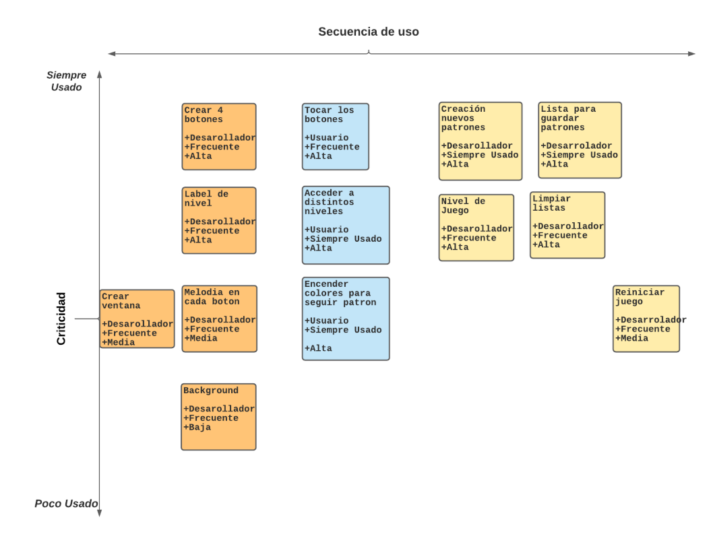
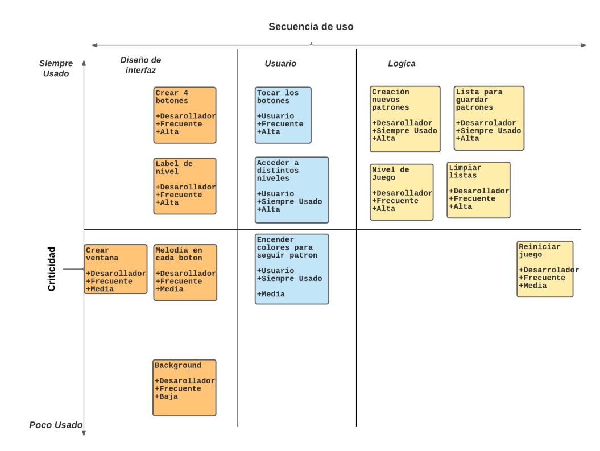
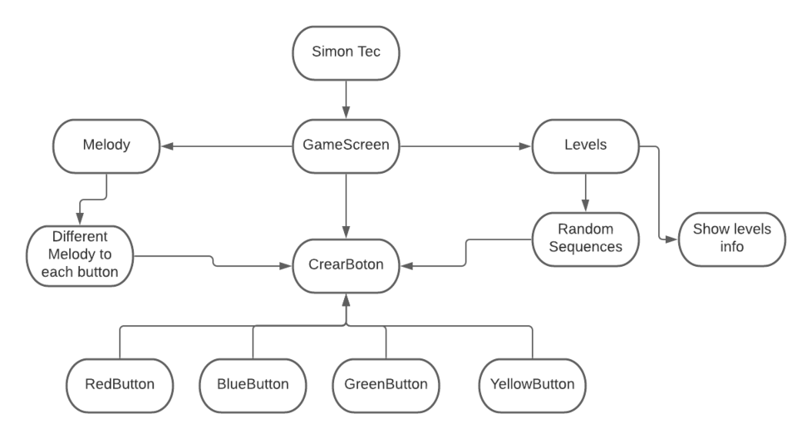
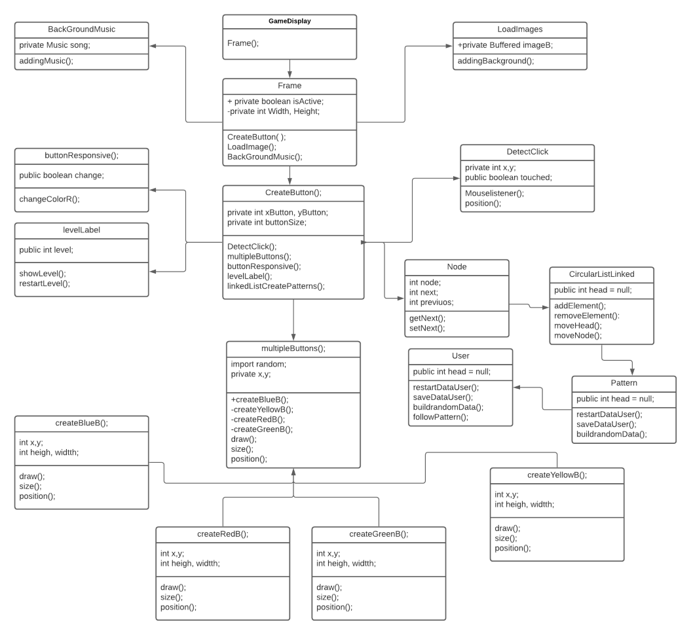

# Simon Tec


***
## > Historias de usuario identificadas del problema propuesto
```markdown

❖ Como usuario: quiero que en la pantalla se genere cuatro botones sean de colores distintos.

❖ Como usuario: quiero que se pueda visualizar en cada botón el color rojo, verde, amarillo y azul.

❖ Como usuario: quiero que los botones posean una melodía.

❖ Como usuario: quiero que se genere una condición de game over.

❖ Como usuario: quiero que posea una cantidad de niveles n.

❖ Como usuario: quiero que el juego genere una secuencia aleatoria en los botones.

❖ Como usuario: quiero que cada nivel tenga una velocidad mayor para cada secuencia.
```


***
## > Clasificación según criticidad y frecuencia de uso



***
## > Minimal system span



***
## > Plan de iteraciones
```markdown
1. Pimer Iteración

▸ Generar una interfaz grafica con 4 botones.

▸ Generar una sequencia a seguir de forma aleatoria.

▸ Verificar que la sequencia compruebe con datos ingresados del usuario.

2. Segunda Iteración

▸ Presionar los botones para generar una secuencias mas extensa.

▸ Generar una melodia a cada boton una vez presionado.

▸ Mostrar el nivel actual con un texto informativo en el centro.

3. Tercer Iteración

▸ Botones con reaccion distintas si el mouse esta encima o no del boton.

▸ Generar una situación de perdida.

▸ Generar una nueva partida con patrones aleatorios.

```

***
## > Diagrama conceptual


***
## > Diagrama de clases a nivel de implementación 

